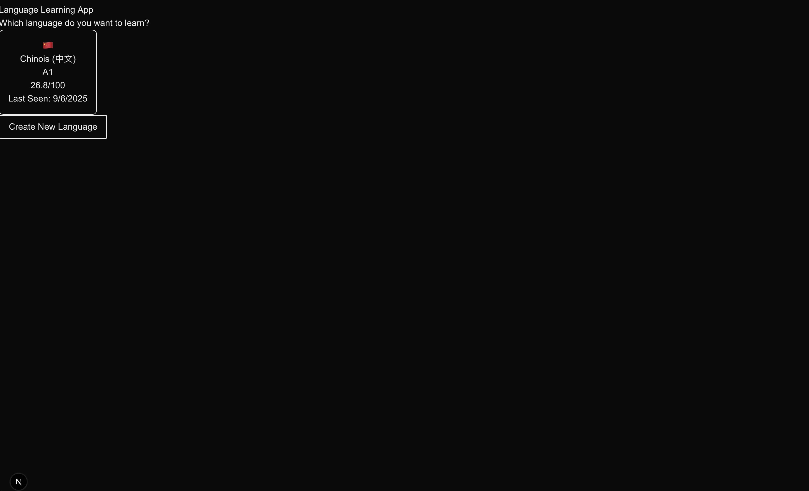
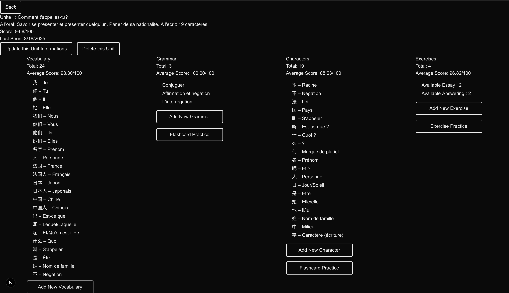
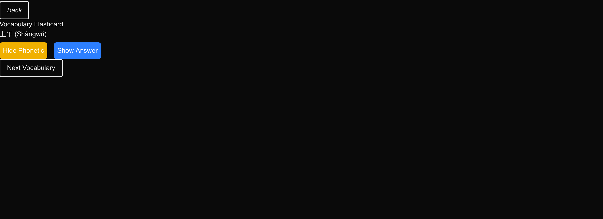
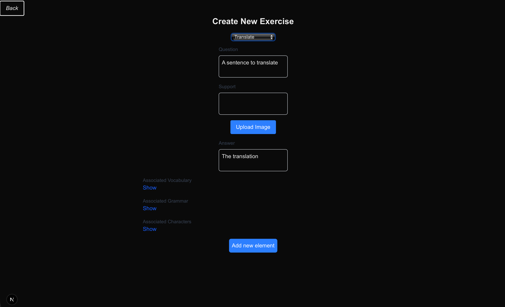
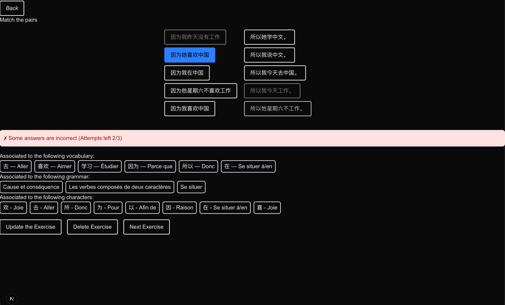
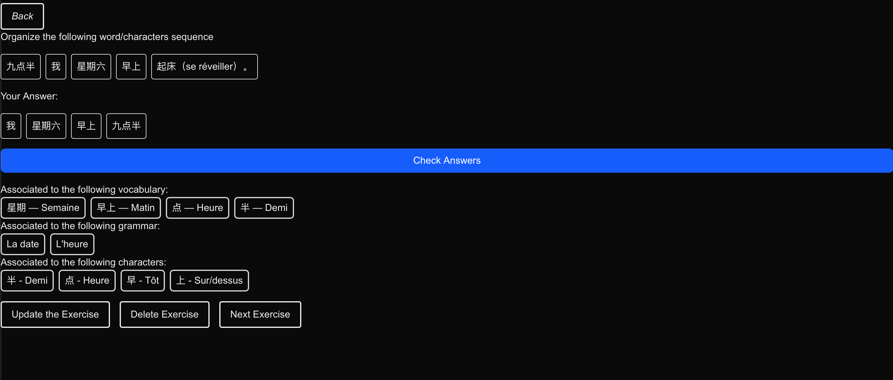
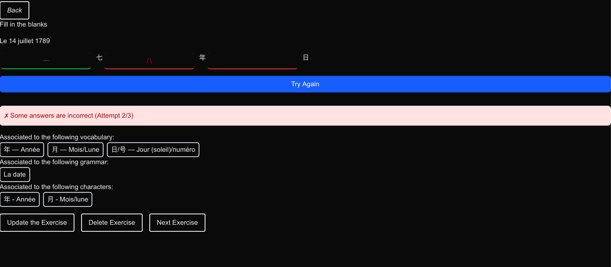

# Language Learning App


A full-stack personal knowledge base for language study. The project combines a Flask API, a Next.js frontend, local media storage, spaced-repetition style scoring, and AI-assisted content generation to organize vocabulary, grammar, calligraphy, and exercises in one place.

## Why this project exists

I wanted a lightweight system for managing my language-learning material without spreading notes across notebooks, screenshots, audio files, and random documents. This app turns those study assets into a structured database with clear relationships:

- Languages contain units.
- Units contain vocabulary, grammar notes, calligraphy items, and exercises.
- Exercises can reference vocabulary, grammar, and calligraphy entries.
- Media files and generated audio stay linked to the learning content they belong to.

## What it does

- Manage multiple languages and split them into units.
- Store vocabulary entries with translations and study scores.
- Store grammar notes and render Markdown content in the frontend.
- Store calligraphy items for character-based languages.
- Create exercises in several formats, including translate, fill-in-the-blank, matching, organize, essay, true/false, and answering modes.
- Upload and serve local image and audio assets.
- Generate example text with a local Hugging Face text-generation model.
- Generate speech audio with Qwen TTS.
- Run scheduled background jobs for backups, text generation, and TTS generation.
- Expose a REST API with Swagger documentation through Flasgger.

## Screenshots

### Home and unit views

| Home | Unit overview |
| --- | --- |
|  |  |

### Study modes

| Flashcards | Create exercise | Matching | Organize |
| --- | --- | --- | --- |
|  |  |  |  |

| Fill in the blank |
| --- |
|  |

## Architecture

### Backend

- Flask application factory with modular blueprints.
- SQLAlchemy models organized by containers, components, and features.
- SQLite by default for local development.
- APScheduler for recurring background jobs.
- Media and backup management stored on disk.
- REST endpoints for languages, units, vocabulary, grammar, calligraphy, exercises, media, and backups.

### Frontend

- Next.js App Router project in [client](client).
- Server and client components for study flows.
- Centralized API layer in [client/src/api/index.tsx](client/src/api/index.tsx).
- Pages for creating, updating, browsing, and practicing learning content.

## Project structure

```text
.
├── client/                 # Next.js frontend
├── src/lapp/               # Flask app package
│   ├── api/routes/         # REST endpoints
│   ├── core/               # Database and scheduler
│   ├── models/             # SQLAlchemy models
│   ├── schemas/            # Pydantic schemas
│   ├── services/           # Media, backup, TTS, text generation
│   └── tasks/              # Scheduled jobs
├── assets/screenshots/     # README screenshots
├── backups/                # Backup storage
├── dev/                    # Development media and backup folders
├── instance/               # SQLite databases
└── media/                  # Production media storage
```

## Tech stack

### Backend

- Python 3.12+
- Flask
- SQLAlchemy
- Pydantic
- APScheduler
- Flasgger
- spaCy language models
- Sentence Transformers
- Qwen TTS
- Hugging Face Transformers

### Frontend

- Next.js 15
- React 19
- TypeScript
- Tailwind CSS 4
- React Markdown

## Getting started

### Prerequisites

- Python 3.12+
- Node.js 20+
- npm
- uv recommended for Python dependency management

### 1. Clone the repository

```bash
git clone https://github.com/elnukakujo/language-learning-app.git
cd language-learning-app
```

### 2. Install backend dependencies

Using `uv`:

```bash
uv sync
```

If you prefer `pip`, install from the project metadata after creating a virtual environment.

### 3. Install frontend dependencies

```bash
cd client
npm install
cd ..
```

### 4. Start the backend

```bash
uv run server --env prod --host 127.0.0.1 --port 5000
```

The API will be available at `http://127.0.0.1:5000`.

Useful endpoints:

- `GET /health`
- `GET /api/languages/`
- Swagger UI via Flasgger when the server is running

### 5. Start the frontend

```bash
cd client
LAPP_URL=http://127.0.0.1:5000 npm run dev
```

The frontend will be available at `http://localhost:3000`.

The client reads the backend URL from `LAPP_URL` and falls back to `http://127.0.0.1:5000` if it is not set.

## Development notes

- Development uses a local SQLite database at `instance/dev_languages.db`.
- Development media files are stored in `dev/media`.
- Development backups are stored in `dev/backups`.
- Background jobs are skipped in testing mode and started automatically in the main Flask process.

## API overview

The backend exposes endpoints for:

- `/api/languages`
- `/api/units`
- `/api/vocabulary`
- `/api/grammar`
- `/api/calligraphy`
- `/api/exercise`
- `/media`
- `/api/backup`

Common operations include listing by language or unit, fetching a single item, creating records, updating records, deleting records, scoring study items, evaluating translation exercises, managing uploads, and handling backup lifecycle operations.

## Current focus areas

- Personal language-course organization
- Interactive study flows from stored content
- Local-first media and backup handling
- AI-assisted sentence and audio generation, as well as translation evaluation
