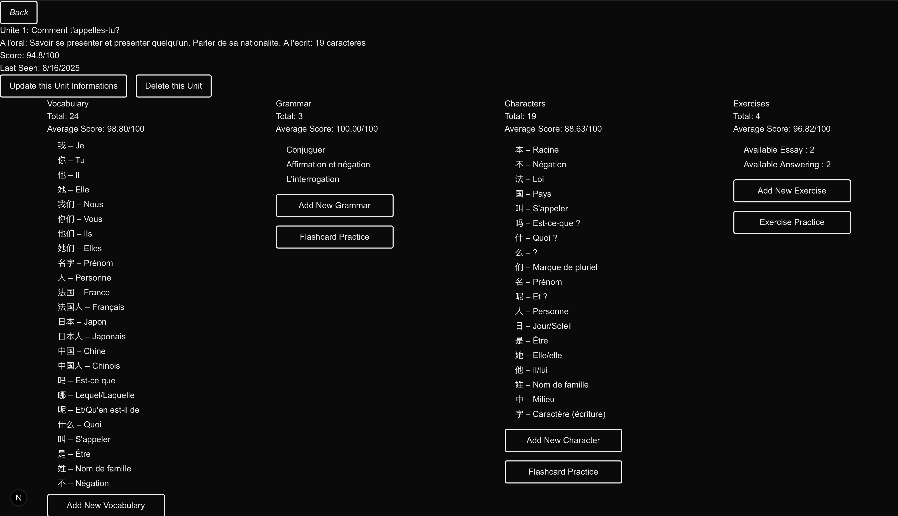
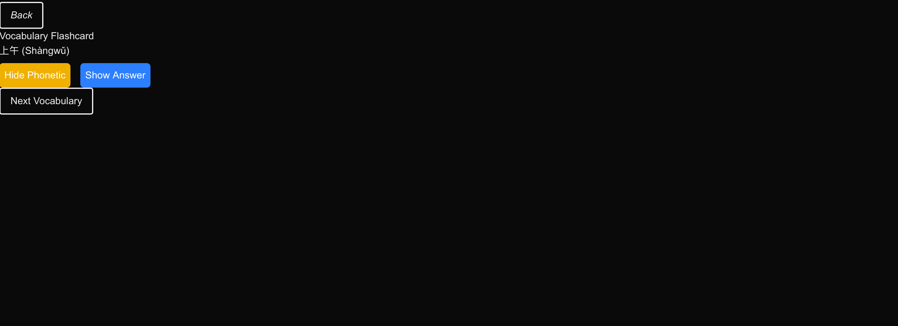
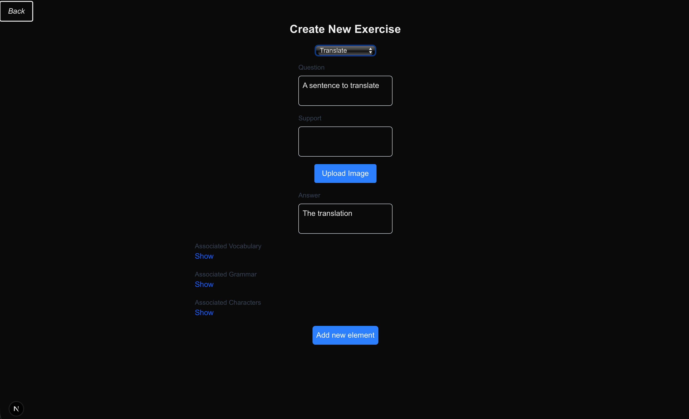
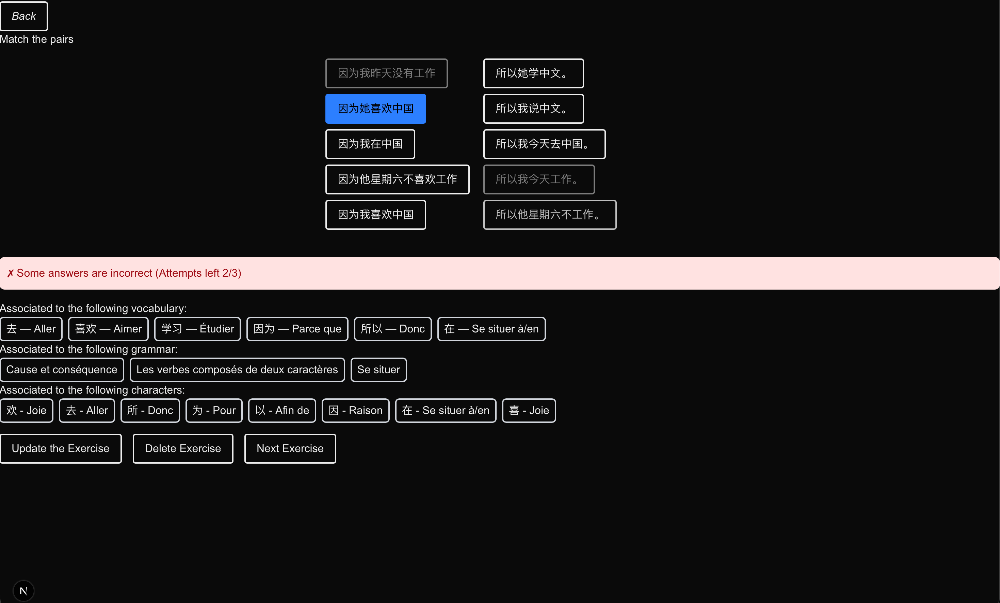
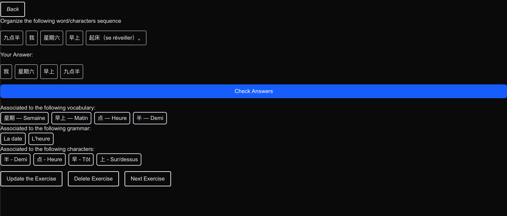
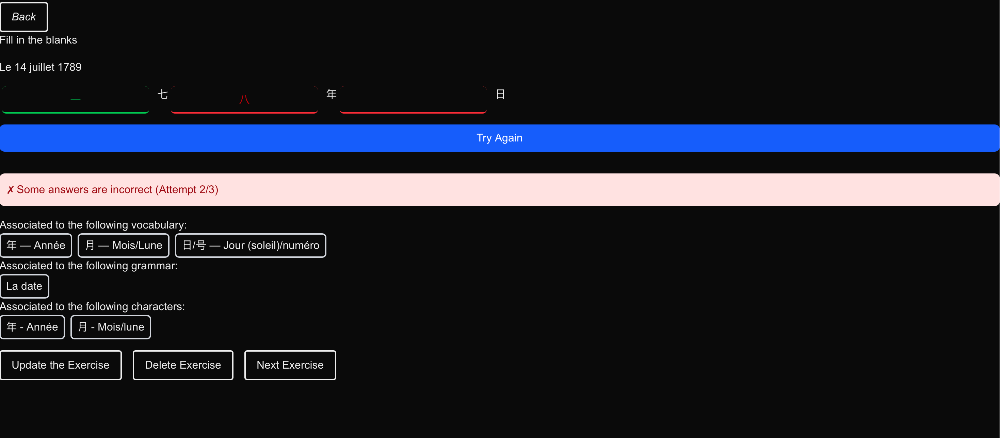

# Fluence


A full-stack, multi-user language learning platform with AI-assisted content generation, speech evaluation, and study tracking. Combines a Flask API, Next.js frontend, per-user configurable LLM backends, and Kubernetes deployment — all designed to organize vocabulary, grammar, characters, words, passages, and exercises in one place.

## What it does

- **Multi-user** with a cookie-based user switcher — each user has their own languages, preferences, and AI config.
- **Language → Lesson → Elements** hierarchy. Lessons group vocabulary, grammar, calligraphy, characters, words, and passages.
- **10 exercise types**: translate, fill-in-the-blank, matching, organize, essay, true/false, answering, speaking, conversation, quizz, type-in-the-blank, and select-in-the-blank.
- **AI-assisted content** — per-user OpenAI-compatible API config for example sentences, word definitions, grammar explanations, and TTS audio generation.
- **Speech evaluation** — record spoken answers, transcribed via Whisper and scored against reference audio/text.
- **AI tutor feedback** — LLM-generated feedback on exercise answers with few-shot prompts.
- **Global search** across all content types with CJK-aware tokenization.
- **Study tracking** — daily stats, commitment log, streak tracking, and a practice heatmap on the home dashboard.
- **Sources & Tags** — attach metadata (textbooks, websites, custom labels) to any learning element.
- **CJK enrichment** — automatic pinyin, radical/stroke count, romanization, and gloss translation for Chinese, Japanese, and Korean.
- **Media management** — upload and serve images/audio; orphaned files auto-cleaned.
- **Action-based backups** — create, restore, list, and delete backups via API; auto-restore on container startup.
- **Kubernetes deployment** — k3s manifests with PVCs for media, backups, and Hugging Face cache.
- **REST API** with Swagger documentation via Flasgger.

## Screenshots

### Home and lesson views

| Home | Lesson overview |
| --- | --- |
|  |  |

### Study modes

| Flashcards | Create exercise | Matching | Organize |
| --- | --- | --- | --- |
|  |  |  |  |

| Fill in the blank |
| --- |
|  |

## Architecture

### Backend

- Flask application factory with modular blueprints.
- SQLAlchemy ORM with Alembic migrations (PostgreSQL in production, SQLite for local dev).
- Atomic ID generation via a dedicated `id_counter` table — race-free across concurrent requests.
- Per-user AI configuration: each user sets their own OpenAI-compatible endpoint, API key, and model for text generation, TTS, and feedback.
- APScheduler for recurring background jobs (backups, text generation, TTS, media cleanup).
- Media and backup storage on disk with configurable roots.
- REST endpoints for 20+ resource types: languages, lessons, vocabulary, grammar, calligraphy, characters, words, passages, exercises, sources, tags, users, preferences, daily stats, commitment logs, search, evaluation, backups, and media.

### Frontend

- Next.js App Router project in [client](client).
- Per-domain API modules in `client/src/api/` (one per resource type).
- Server and client components for study flows, user management, and settings.
- Pages for creating, updating, browsing, and practicing all content types.

## Project structure

```text
.
├── client/                  # Next.js frontend
├── src/lapp/                # Flask app package
│   ├── api/routes/          # REST endpoints (20+ resource types)
│   ├── core/                # Database, scheduler, config
│   ├── models/              # SQLAlchemy models (containers, components, features, system_data, data_collection)
│   ├── schemas/             # Pydantic schemas
│   ├── services/            # Media, backup, TTS, text gen, search, evaluation, feedback
│   ├── tasks/               # Scheduled background jobs
│   └── utils/               # CJK enrichment, model API client, phonetics, tokenization
├── alembic/                 # Database migrations
├── k8s/                     # Kubernetes manifests (k3s)
├── docker/                  # Docker entrypoint, migration, backup scripts
├── assets/screenshots/      # README screenshots
├── media/                   # Production media storage
├── backups/                 # Backup storage
└── tests/                   # Test suite
```

## Tech stack

### Backend

- Python 3.12+
- Flask
- SQLAlchemy (with Alembic)
- Pydantic
- APScheduler
- Flasgger (Swagger)
- PostgreSQL / SQLite
- spaCy, Sentence Transformers
- Whisper (speech-to-text)
- language-tool-python (grammar checking)
- pypinyin, pykakasi, hangul-romanize, hanzipy (CJK enrichment)
- argostranslate (gloss translation)

### Frontend

- Next.js 15
- React 19
- TypeScript
- Tailwind CSS 4
- React Markdown

### Infrastructure

- Docker & Docker Compose
- Kubernetes (k3s)
- PersistentVolumes for media, backups, HF cache

## Getting started

### Prerequisites

- Python 3.12+
- Node.js 20+
- npm
- uv recommended for Python dependency management

### 1. Clone the repository

```bash
git clone https://github.com/elnukakujo/vocabulary-dbms.git
cd vocabulary-dbms
```

### 2. Install backend dependencies

```bash
uv sync
```

### 3. Install frontend dependencies

```bash
cd client
npm install
cd ..
```

### 4. Start the backend and frontend together

```bash
./scripts/run.sh --env prod --host 127.0.0.1 --port 5000
```

This starts the Flask API and the Next.js client in one command, and stops both on Ctrl+C. In `--env prod` (or `LAPP_ENV=prod`), the client is built and served with `next start`; otherwise `next dev`.

The API will be available at `http://127.0.0.1:5000` and the client at `http://localhost:3000`.

Useful endpoints:

- `GET /health`
- `GET /api/languages/`
- Swagger UI via Flasgger

To run either process standalone:

```bash
uv run server --env prod --host 127.0.0.1 --port 5000
```

```bash
cd client
LAPP_URL=http://127.0.0.1:5000 npm run dev
```

The client reads the backend URL from `LAPP_URL` (falls back to `http://127.0.0.1:5000`).

### Running with Docker

```bash
cp .env.example .env   # fill in DATABASE_URL, POSTGRES_*, etc.
docker compose up --build
```

- Database migrations run automatically on backend startup.
- The API is available at `http://localhost:${LAPP_PORT:-5000}` and the client at `http://localhost:${PORT:-8080}`.
- `PROD_MEDIA_ROOT`/`PROD_BACKUP_ROOT` (if set) are bind-mounted into the backend container.

### Kubernetes (k3s)

```bash
cp k8s/secrets.yaml.example k8s/secrets.yaml   # fill in secrets
./k8s/deploy.sh
```

Manifests deploy the full stack (Postgres, backend, frontend) with PVC-based persistence.

## API overview

| Endpoint | Resources |
| --- | --- |
| `/api/languages` | Language CRUD |
| `/api/lessons` | Lesson CRUD |
| `/api/vocabulary` | Vocabulary entries |
| `/api/grammar` | Grammar notes (Markdown) |
| `/api/calligraphy` | Calligraphy items |
| `/api/character` | Characters (CJK) |
| `/api/word` | Words |
| `/api/passage` | Passages |
| `/api/exercise` | Exercises (10+ types) |
| `/api/user` | User CRUD + password management |
| `/api/pref` | Per-user preferences, AI config, endpoint testing |
| `/api/sources` | Source CRUD + attach/detach |
| `/api/tags` | Tag CRUD + attach/detach |
| `/api/search` | Global search (CJK-aware) |
| `/api/evaluate` | Text and speech answer evaluation |
| `/api/daily-stats` | Daily study stats and history |
| `/api/commitment-log` | Long-term study tracking |
| `/api/backup` | Create, restore, list, info, delete backups |
| `/media` | Media upload and serve |

## Multi-user system

Users switch via a cookie-based picker — no login required. Each user has:
- Their own languages, lessons, and study progress.
- Configurable preferences (native language, daily goal, preferred exercise types).
- Per-user AI API settings (base URL, key, model) for text generation, TTS, and feedback.

## AI & LLM

All AI features use a user-configured OpenAI-compatible API. No hardcoded model — each user brings their own endpoint (llama.cpp, Ollama, OpenAI, Anthropic, DeepSeek, Kimi, etc.). Features gated behind per-user toggles:
- Example sentences for vocabulary, grammar, and calligraphy
- Example words and definitions
- TTS audio generation
- Tutor feedback on exercise answers
- Speech evaluation via Whisper (server-side STT model)

## Development notes

- Development uses SQLite at `instance/dev_languages.db`.
- Development media in `media_dev/`, backups in `backups_dev/`.
- Background jobs are skipped in testing mode.
- Set `LAPP_ENV=dev` for auto-reload and debug endpoints.
